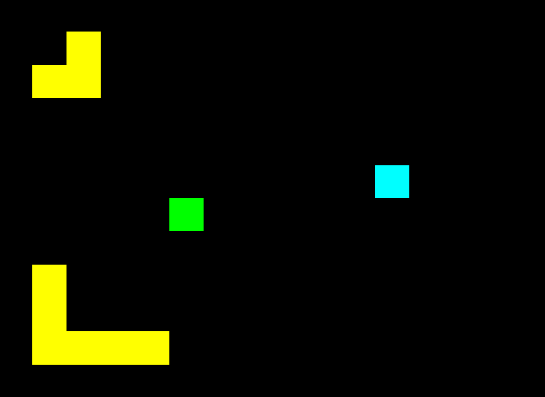

# Easy Game (Game)

Easy Game (Game) is a simple game created in 2 hours. Goal is go to finish on simple maps.

### Adding new level

1. Create file "level_(next number).dat".
2. In first line write two arguments: width and height.
3. Next lines are level description. In one line must be wisth number values:
    - 0 - empty
    - 1 - block
    - 2 - start
    - 3 - finish
4. Change number of levels in Game.cfg file.

## Code

[https://github.com/simivoid/Game](https://github.com/simivoid/Game)